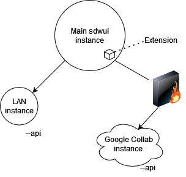

# stable-diffusion-webui-distributed
This extension enables you to chain multiple webui instances together for txt2img and img2img generation tasks.

There is an emphasis on minimizing the perceived latency/lag of large batch jobs in the **main** sdwui instance.

\
*Diagram showing Master/slave architecture of the extension*

**Contributions and feedback are much appreciated!**

[](https://discord.gg/INVITEID)

## Installation

On the master instance:
- Go to the extensions tab, and swap to the "available" sub-tab. Then, search "Distributed", and hit install on this extension.
- Ensure that you have setup your `COMMANDLINE_ARGS` include the necessary info on your remote machines. Ex:
```
set COMMANDLINE_ARGS=--distributed-remotes laptop:192.168.1.3:7860 argon:fake.local:7860 --distributed-skip-verify-remotes --distributed-remotes-autosave
```

On each slave instance:
- enable the api by passing `--api` and ensure it is listening by using `--listen`
- ensure all of the models, scripts, and whatever else you think you might request from them is present\
Ie. if you're using sd-1.5 on the controlling instance, then the sd-1.5 model should also be present on each slave instance. Otherwise, the remote will fallback to some other model that **is** present.

*if you want to sync models and etc. between a huge amount of nodes you might want to use something like rsync or winscp*

# Usage Notes
- If benchmarking fails, try hitting the **Redo benchmark** button under the script's **Util** tab.
- You need to have all of the workers you plan to use connected when benchmarking for things to work properly (will be fixed later).
- If any remote is taking far too long to returns its share of the batch, you can hit the **Interrupt** button in the **Util** tab.

#### Command-line arguments

**--distributed-remotes** Enter n pairs of sockets corresponding to remote workers in the form `name:address:port`\
**--distributed-skip-verify-remotes** Disable verification of remote worker TLS certificates (useful for if you are using self-signed certs like with auto tls-https)\
**--distributed-remotes-autosave** Enable auto-saving of remote worker generations\
**--distributed-debug** Enable debug information
